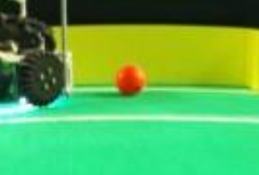

# Annotation guide

## Software

[AnyLabeling](https://github.com/vietanhdev/anylabeling)

## Chunky

1. [OneDrive](https://gamca-my.sharepoint.com/:f:/g/personal/misiak1_gamca_sk/Eo1ZiPH6jhJHplvrdqXCB28BSJIqW-pfNtqcpf7Q18kK7w): Skontroluj aky chunk este nie je urobeny v `evidencia.xlsx`, najlepsie z takeho stlpca co ich ma najmenej.
2. Stiahni ho a rozbal ho
3. Otvor rozbaleny priecinok v AnyLabeling
4. Anotuj
5. Po skonceni zavolaj `python export_labels.py cesta/ChunkXXX`
6. Nahraj vytvoreny zip do OneDrivu, priecinok `annotations`
7. Napis `x` k chunku do `evidencia.xlsx`

## Anotacia

### Labely

- ball
- smudge

#### Ball

Dobre viditelna lopta alebo jej cast.

#### Smudge

Akakolvek lopta, ktora je v nejakom smere vacsia ako cca 1.75-nasobok skutocnej velkosti lopty.

### Ako anotovat

1. Loptu oznacit az pokial si myslis ze ide, pripadne po kraj obrazka ak by isla dalej

2. Snazit sa trafit bounding box co najpresnejsie
3. Snazit sa hranicu medzi ball a smudge mat co najkonzistentnejsiu
